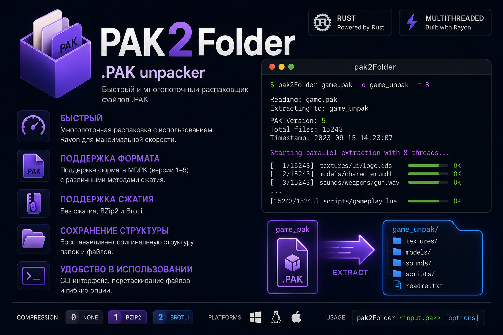

# pkg2folder

> ⚡ Fast multithreaded extractor for MDPK (.PAK) archives written in Rust.

`pkg2folder` is a lightweight command-line tool that extracts game `.PAK` archives while preserving the original directory structure. It supports multiple compression algorithms and utilizes all available CPU cores for maximum performance.

## Features

- 🚀 Fast parallel extraction (Rayon)
- 📦 Supports MDPK archive format
- 🗂 Preserves original folder hierarchy
- 🧩 Supports:
  - No compression
  - BZip2
  - Brotli
- 💻 Cross-platform (Windows, Linux, macOS)
- ⚙️ Configurable thread count
- 🎯 Drag & Drop support on Windows

---

## Installation

### Build from source

```bash
git clone https://github.com/Terramin/PAK-Extractor.git
cd pkg2folder
cargo build --release
```

Binary will be located in

```
target/release/pkg2folder
```

---

## Usage

Extract archive:

```bash
pkg2folder game.pak
```

Specify output directory:

```bash
pkg2folder game.pak -o folder/output
```

Use specific number of threads:

```bash
pkg2folder game.pak -t 8
```

Display help:

```bash
pkg2folder --help
```

---

## Command Line Options

| Option | Description |
|---------|-------------|
| `-o`, `--output` | Output directory |
| `-t`, `--threads` | Number of extraction threads |
| `--help` | Show help |
| `--version` | Show version |

---

## Supported Compression

| ID | Compression |
|----|-------------|
| 0 | None |
| 1 | BZip2 |
| 2 | Brotli |

---

## Example Output

```
Reading: game.pak
Extracting to: game_unpak

PAK Version: 5
Total files: 15243

Starting parallel extraction...

[15243/15243] scripts/init.lua OK

Extraction completed successfully!
```

---

## Performance

The extractor uses **Rayon** to unpack files in parallel, significantly reducing extraction time on modern multi-core CPUs.
